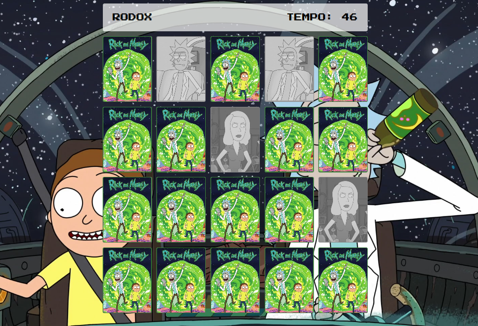

<h1 align="center"> WRECKED MEMORY </h1>

<h3 align="center">
  <a href="https://cronometro-iota.vercel.app">Acesse Meu App</a>
</h3>

  

## 🚀 Tecnologias

Esse projeto foi desenvolvido com as seguintes tecnologias:

- HTML e CSS
- JavaScript
- Git e GitHub

## 💻 Projeto

Criar um jogo da memória com tela de login, coletando nome do jogador e armazenando na memória local.
